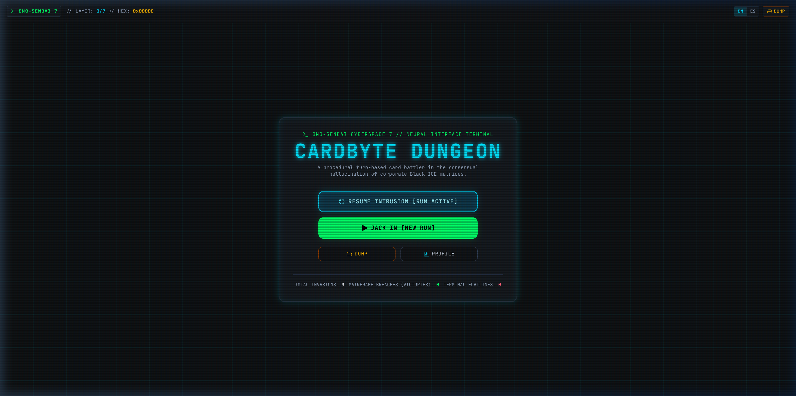
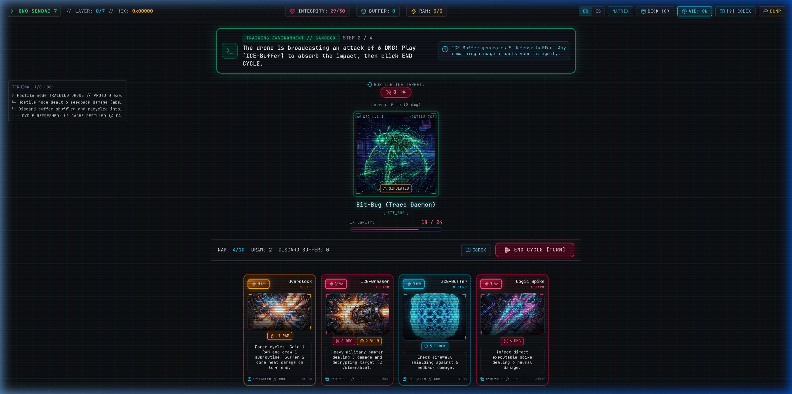
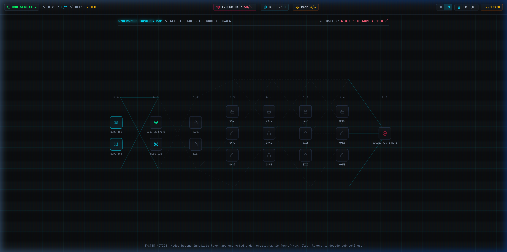
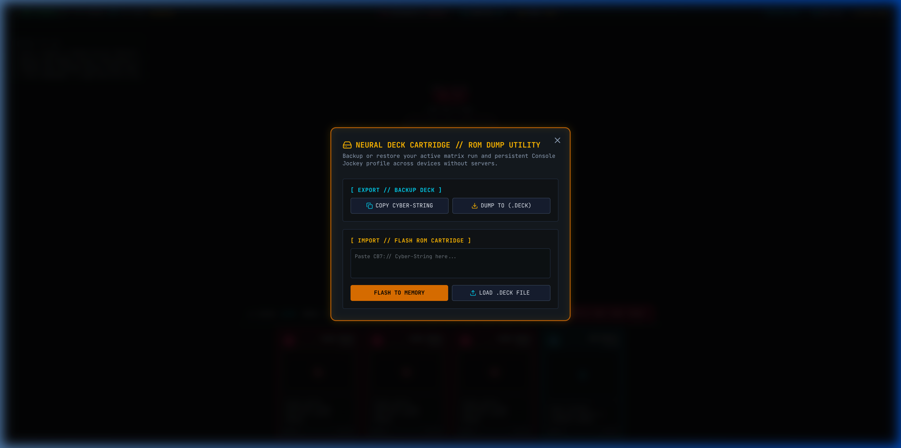

# CARDBYTE DUNGEON // ONO-SENDAI CYBERSPACE 7

```text
 ╔═══════════════════════════════════════════════════════════════════════════════╗
 ║  ___   _   ___ ___  ______   _______ ___   ___ ___ _  _  ___ ___ ___  _  _    ║
 ║ / __| /_\ | _ \   \| _ \ \ / /_   _| __|  |   \_ _| \| |/ __| __/ _ \| \| |   ║
 ║| (__ / _ \|   / |) | _ /\ V /  | | | _|   | |) | || .` | (_ | _| (_) | .` |   ║
 ║ \___/_/ \_\_|_\___/|___/ |_|   |_| |___|  |___/___|_|\_|\___|___\___/|_|\_|   ║
 ║                                                                               ║
 ║  [ PROTOCOL GIBSON-84 ] // [ ONO-SENDAI 7 BIOS ] // [ DECK INITIALIZED ]      ║
 ╚═══════════════════════════════════════════════════════════════════════════════╝
```

<p align="center">
  <strong>A Procedural Cyberpunk Roguelike Deckbuilder for the Terminal Era</strong><br>
  <em>Built for modern browsers with zero heavy external assets. High-octane tactical combat in the consensual hallucination of corporate Black ICE matrices.</em>
</p>

<p align="center">
  
  
  
  
  
  
  
</p>

---

## 🌐 Language Selector / Selector de Idioma

- **[English Documentation](#-english-version)**
- **[Documentación en Español](#-versión-en-español)**

---

<a name="-english-version"></a>
# 🇬🇧 English Version

## 📖 Lore: Consensual Hallucination (Gibson-84)

> *"Cyberspace. A consensual hallucination experienced daily by billions of legitimate operators, in every nation... A graphic representation of data abstracted from banks of every computer in the human system. Unthinkable complexity. Lines of light ranged in the nonspace of the mind, clusters and constellations of data. Like city lights, receding..."*  
> — **William Gibson, *Neuromancer* (1984)**

You are an underground console cowboy jacked into your custom **Ono-Sendai Cyberspace 7** cyberdeck through direct neural derm-trodes. Your target: the deepest corporate subnet guarded by lethal, military-grade **Black ICE**, culminating in the rogue super-AI known only as **WINTERMUTE**.

If your biological buffer collapses in cyberspace, high-voltage neural feedback will surge through your interface ports, resulting in a permanent **FLATLINE**.



---

## ⚔️ Gameplay & Mechanics

### 1. The Tri-Stat Neural System
Traversing the matrix requires balancing three fundamental resources:
- **Neural Integrity (HP)**: Your biological health in meatspace. If this reaches 0, you flatline.
- **ICE-Buffer (Block)**: Firewall shielding created by defensive algorithms that absorbs incoming feedback damage before it hits your flesh HP. Resets at the start of your turn.
- **Deck RAM (Energy)**: Computational cycles available each turn (default: 3 RAM) used to execute subroutines from hand.

### 2. Subroutine Catalog (Holographic Cyberdeck ROMs)
Subroutines are mounted in tactical cyberdeck ROM cartridges featuring dedicated neural telemetry artworks, glowing neon RAM energy badges, instant stat telemetry chips (`[DMG]`, `[BLOCK]`, `[VULN]`), and dynamic holographic foil sheens for upgraded (`+`) and rare-tier chips.

Every deck begins with 8 starter subroutines:
- **4x Logic Spike**: 1 RAM, Attack dealing 6 neural damage.
- **3x ICE-Buffer**: 1 RAM, Defend raising a 5-point firewall.
- **1x ICE-Breaker**: 2 RAM, Heavy hammer dealing 8 damage and decrypting ports (**2 Vulnerable**).

Throughout the run, expand and refine your ROM with draft rewards:
- **Logic Worm**: Injects persistent **Poison** bypassing shields directly into host memory each turn.
- **Packet Jam**: Applies **Weak** (-25% incoming damage) and raises a defensive buffer.
- **Overclock**: 0 RAM, instantly grants +1 RAM cycle and draws 1 card, but vents 2 heat damage to flesh HP at turn's end.
- **Execute**: Precision attack dealing 8 damage, doubling to 16 if the target is **Decrypted (Vulnerable)**.
- **Firewall Aura**, **System Purge**, **Bruteforce**, and **Neuro-Toxin**.

### 3. Hostile ICE Constructs & Threat Telemetry
Hostile entities inhabit dedicated scanner telemetry viewports with custom cyberpunk illustrations, corner reticles, scanline overlays, and predictive intent broadcasting:
- **Bit-Bug (Trace Daemon)**: Fast, insectoid surveillance construct scouting cyberspace perimeters (`bit_bug.webp`).
- **Memory-Brute (Black ICE)**: Heavy armored server monolith guarding corporate corridors (`memory_brute.webp`).
- **Daemon-Cultist (Corrupted Subroutine)**: Arcane ritual malware wielding corrupted violet code leaks (`daemon_cultist.webp`).
- **Wintermute (Matrix-God AI Core)**: Transcendent super-intelligence boss emanating pulsing crimson signal shimmers and quantum tendrils (`wintermute.webp`).
- **Apex-ICE Elites**: High-threat variations featuring pulsing amber breach perimeters and volatile combat affixes (*Armored*, *Volatile*, *Cursed*).



### 4. Matrix Topology (Procedural 8-Layer Graph)
The cyberspace map consists of 8 procedural layers generated from a single deterministic **HEX Seed**:
- **Layer 0–2**: Outer perimeter daemons (Bit-Bugs, Trace Daemons).
- **Layer 3–6**: Intermediate corporate Black ICE and Apex ICE nodes.
- **Layer 7**: The **Wintermute Core** mainframe confrontation.
- **Cryptographic Fog-of-War**: Beyond your immediate next move, remote nodes are cloaked under cryptographic hashes until you advance.



### 5. Specialized Matrix Nodes
- **ICE Nodes**: Standard security daemon combats.
- **Apex ICE**: High-threat elite nodes with hostile affixes (*Armored*, *Volatile*, *Cursed*), yielding rare subroutines.
- **Cache Nodes (Rest)**: Execute a **Core Cooldown** (+15 Flesh HP repair), a **Code Refactor** (permanently upgrading a subroutine to `+`), or a **Purge Subroutine** (thinning obsolete cards from cyberdeck ROM, with an automatic $\ge 4$ card safeguard).
- **Data Vaults (Treasure)**: Extract high-priority military subroutines.

---

## 🌐 Type-Safe Internationalization (i18n)

*CardByte Dungeon* features an instant in-memory localization system between **English** and **Spanish**:
- **Zero Heavy Libraries**: Built with native TypeScript record dictionaries (`src/locales/`), verifying translation keys at compile time.
- **Lore-Friendly Tone**: Translates UI, instructions, and card effects into evocative Spanish while preserving essential cyberpunk anglicisms (*ICE*, *RAM*, *Cyberdeck*, *Flatline*, *Glitch*).
- **Live Reactivity**: Toggle between `[ EN | ES ]` in the TopBar at any moment without page reloads; your preference persists automatically in `localStorage`.

---

## 💾 Zero-Backend Persistence & ROM Dump Utility

No accounts, databases, or cloud servers are required. *CardByte Dungeon* is 100% client-side and sovereign:
- **Deterministic Auto-Save**: Saves run progress, deck state, current node, and console statistics after every action.
- **Portable Cyber-String**: Export your entire save state into an encoded `CB7://` string with checksum validation to transfer between browsers.
- **Cartridge Files (.deck)**: Download your offline profile as a `.deck` file or load an existing dump instantly.



---

## 🛠️ Technical Architecture

| Dimension | Technology | Rationale |
| :--- | :--- | :--- |
| **Core Framework** | **React 19 + TypeScript 5.9** | Strict type safety across game state, combat mechanics, and i18n dictionaries. |
| **Build Tooling** | **Vite 8** | Near-instant HMR and ultra-fast, optimized production bundling (<320 kB). |
| **Styling** | **Tailwind CSS v4** | Pure CSS retro CRT glow, scanlines, cyan/crimson matrices, and responsive 100vh constraint. |
| **State Management** | **Zustand** | Multi-slice architecture (`RunSlice`, `CombatSlice`, `UISlice`) with granular re-renders. |
| **Icons & SFX** | **Lucide React** | Scalable, clean SVG terminal telemetry with zero bitmap images. |
| **Math & RNG** | **Mulberry32 PRNG** | Deterministic 32-bit pseudo-random numbers driven by hex seeds. |

---

## 🚀 Quickstart & Local Installation

### Prerequisites
- **Node.js**: v18.0.0 or higher
- **npm**: v9.0.0 or higher

### 1. Clone the repository
```bash
git clone https://github.com/ArturoHerrera/cardbyte-dungeon.git
cd cardbyte-dungeon
```

### 2. Install dependencies
```bash
npm install
```

### 3. Launch the development server
```bash
npm run dev
```
Open your browser and navigate to:
```text
http://127.0.0.1:5173/
```

### 4. Build for production
```bash
npm run build
```
The compiled, zero-asset client bundle will be generated in `dist/`.

---

<br>

---

<a name="-versión-en-español"></a>
# 🇲🇽 Versión en Español

## 📖 Lore: Alucinación Consensual (Gibson-84)

> *"Ciberespacio. Una alucinación consensual experimentada diariamente por billones de operadores legítimos, en todas las naciones... Una representación gráfica de la información abstraída de los bancos de todos los ordenadores del sistema humano. Complejidad impensable. Líneas de luz alineadas en el no-espacio de la mente, cúmulos y constelaciones de datos. Como las luces de una ciudad, alejándose..."*  
> — **William Gibson, *Neuromante* (1984)**

Eres un vaquero de consola clandestino conectado a tu ciberdeck **Ono-Sendai Cyberspace 7** mediante derm-trodos neurales directos. Tu objetivo: penetrar la subred corporativa más profunda, protegida por letal **Black ICE** militar, y descompilar la superinteligencia artificial rebelde conocida como **WINTERMUTE**.

Si tu buffer biológico colapsa dentro de la matriz, la retroalimentación de alto voltaje freirá tu corteza cerebral, resultando en una muerte inmediata: **FLATLINE**.


---

## ⚔️ Mecánicas y Dinámica de Juego

### 1. Sistema de Tres Recursos Neurales
- **Integridad Neural (HP)**: Tu salud biológica en el mundo real. Si llega a 0, sufres un flatline terminal.
- **ICE-Buffer (Defensa / Bloqueo)**: Escudo de firewall generado por tus algoritmos defensivos que absorbe daño antes de tocar tu HP. Se reinicia al inicio de tu turno.
- **RAM del Ciberdeck (Energía)**: Ciclos de procesamiento disponibles por turno (por defecto: 3 RAM) para ejecutar subrutinas desde la mano.

### 2. Catálogo de Subrutinas (Cartuchos ROM Holográficos)
Las subrutinas están montadas en cartuchos ROM tácticos de ciberdeck con arte neuronal temático en alta resolución, celdas de RAM neón de alta visibilidad, chips de impacto estadístico inmediato (`[DMG]`, `[BLOCK]`, `[VULN]`) y un efecto tornasol foil holográfico en subrutinas mejoradas (`+`) y chips raros.

Tu mazo inicial arranca con 8 subrutinas esenciales:
- **4x Spike Lógico**: 1 RAM, Ataque que inflige 6 de daño neural.
- **3x ICE-Buffer**: 1 RAM, Defensa que levanta un firewall de 5 puntos.
- **1x Rompehielos**: 2 RAM, Martillo militar que causa 8 de daño y aplica **2 Vulnerable**.

Conforme superas nodos de seguridad, descubres subrutinas avanzadas:
- **Gusano Lógico**: Inyecta **Veneno** persistente que daña directamente la integridad del objetivo cada ciclo ignorando escudos.
- **Saturación de Paquetes**: Aplica **Débil** (-25% de daño enemigo) y otorga ICE-Buffer.
- **Overclock**: 0 RAM, genera +1 ciclo de RAM y roba 1 carta, sufriendo 2 de daño térmico al final del turno.
- **Ejecutar**: Exploit letal de 8 de daño (se duplica a 16 si el ICE enemigo está Desencriptado/Vulnerable).
- **Aura Firewall**, **Purga del Sistema**, **Fuerza Bruta**, **Neuro-Toxina**.

### 3. Constructos ICE Hostiles y Telemetría de Amenazas
Las entidades hostiles habitan en un visor táctico de escaneo con ilustraciones cyberpunk dedicadas, retículas de sensores, líneas de escaneo y telemetría de intenciones:
- **Bit-Bug (Daemon de Rastreo)**: Constructo insectoide ágil que patrulla los perímetros de la red (`bit_bug.webp`).
- **Memory-Brute (Black ICE)**: Monolito acorazado estilo servidor pesado que bloquea corredores corporativos (`memory_brute.webp`).
- **Daemon-Cultist (Subrutina Corrupta)**: Entidad arcana de código que propaga fugas de datos violetas (`daemon_cultist.webp`).
- **Wintermute (IA Central / Dios de la Matriz)**: Jefe final de inteligencia cósmica que proyecta un aura carmesí y pulsos cuánticos (`wintermute.webp`).
- **Élites Apex-ICE**: Variantes de alta peligrosidad con perímetros ámbar pulsantes y afijos volátiles (*Blindado*, *Volátil*, *Maldito*).


### 4. Topología de la Matriz (Grafo de 8 Capas)
El mapa de infiltración se genera proceduralmente con una semilla **HEX**:
- **Capas 0 a 2**: Daemons de rastreo perimetrales (Bit-Bugs).
- **Capas 3 a 6**: Black ICE reforzado y nodos de élite Apex ICE.
- **Capa 7**: El mainframe central de **Wintermute**.
- **Niebla Criptográfica**: Las capas lejanas se encuentran encriptadas hasta que asegures los nodos anteriores.


### 5. Nodos Especiales de la Red
- **Nodos ICE**: Combates contra programas de seguridad estándar.
- **Apex ICE**: Nodos élite con afijos de combate hostiles (*Blindado*, *Volátil*, *Maldito*), otorgando subrutinas raras.
- **Nodos de Caché (Descanso)**: Permite ejecutar un **Enfriamiento** (+15 HP de integridad), una **Refactorización** (mejora permanente `+` a una subrutina) o una **Depuración de Subrutina** (eliminar permanentemente una carta obsoleta del mazo, con salvaguarda de $\ge 4$ cartas).
- **Bóvedas de Datos (Tesoro)**: Extracción directa de subrutinas militares.

---

## 🌐 Internacionalización Tipo-Segura (i18n)

*CardByte Dungeon* incluye un motor de localización nativo en memoria con cambio en tiempo real entre **Inglés** y **Español**:
- **Cero Librerías Externas**: Basado en diccionarios tipados de TypeScript (`src/locales/`), garantizando consistencia en compilación.
- **Atmósfera Cyberpunk Auténtica**: Traduce explicaciones, controles y cartas manteniendo anglicismos icónicos (*ICE*, *RAM*, *Cyberdeck*, *Flatline*, *Glitch*).
- **Reactividad Inmediata**: Conmuta con el botón `[ EN | ES ]` de la barra superior en cualquier momento; la preferencia se guarda automáticamente en `localStorage`.

---

## 💾 Persistencia sin Servidor & Utilidad de Volcado ROM

El juego es 100% autosuficiente y funciona en el cliente sin requerir bases de datos remotas:
- **Auto-guardado Determinista**: Almacena de inmediato el estado del combate, cartas, vida y estadísticas de incursión en `localStorage`.
- **Cyber-String Portátil**: Exporta tu sesión en una cadena de texto codificada `CB7://` con suma de verificación (checksum) para mover partidas entre navegadores.
- **Archivos de Cartucho (.deck)**: Descarga un volcado físico de tu memoria como archivo `.deck` o carga respaldos previos en un clic.


---

## 🛠️ Especificaciones Técnicas y Arquitectura

| Componente | Tecnología | Propósito |
| :--- | :--- | :--- |
| **Núcleo** | **React 19 + TypeScript 5.9** | Tipo-seguridad total en combate, catálogo de cartas y diccionarios i18n. |
| **Empaquetador** | **Vite 8** | Recarga ultra-rápida (HMR) y bundle de producción ligero (<320 kB). |
| **Diseño / Estilos** | **Tailwind CSS v4** | Estética CRT, resplandor de fósforo verde/cian, rejillas y viewport estricto 100vh sin scroll. |
| **Gestor de Estado** | **Zustand** | Arquitectura modular de 3 rebanadas (`RunSlice`, `CombatSlice`, `UISlice`). |
| **Iconografía** | **Lucide React** | Telemetría SVG nítida sin imágenes bitmap pesadas. |
| **RNG Determinista**| **PRNG Mulberry32** | Generación procedural basada en semillas hexadecimales compartibles. |

---

## 🚀 Instalación y Ejecución Local

### Requisitos previos
- **Node.js**: v18.0.0 o superior
- **npm**: v9.0.0 o superior

### 1. Clonar el repositorio
```bash
git clone https://github.com/ArturoHerrera/cardbyte-dungeon.git
cd cardbyte-dungeon
```

### 2. Instalar dependencias
```bash
npm install
```

### 3. Iniciar el entorno de desarrollo
```bash
npm run dev
```
Abre tu navegador en:
```text
http://127.0.0.1:5173/
```

### 4. Compilar para producción
```bash
npm run build
```
El bundle optimizado listo para producción se creará en la carpeta `dist/`.

---

<p align="center">
  <em>ONO-SENDAI 7 BIOS // REVISIÓN 1.0.4 // PROTOCOLO GIBSON-84 // JOCKEY LINK: ACTIVE</em>
</p>
